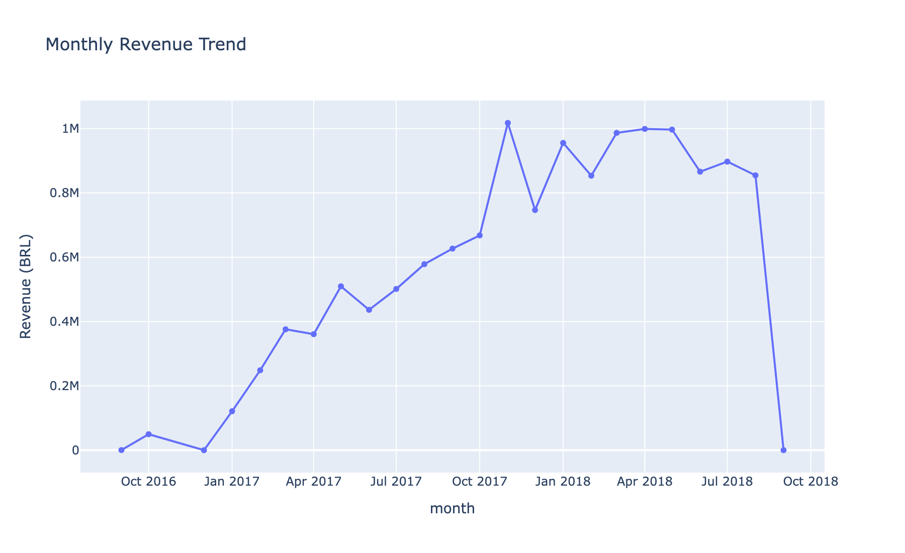
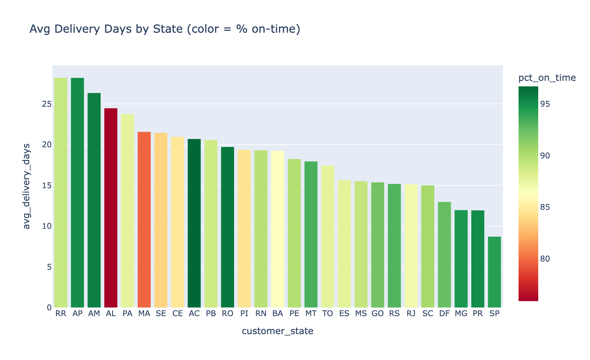
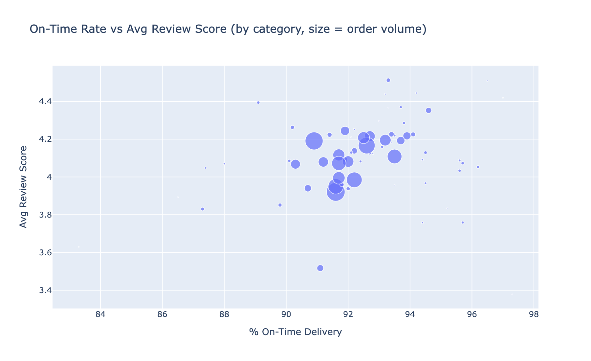
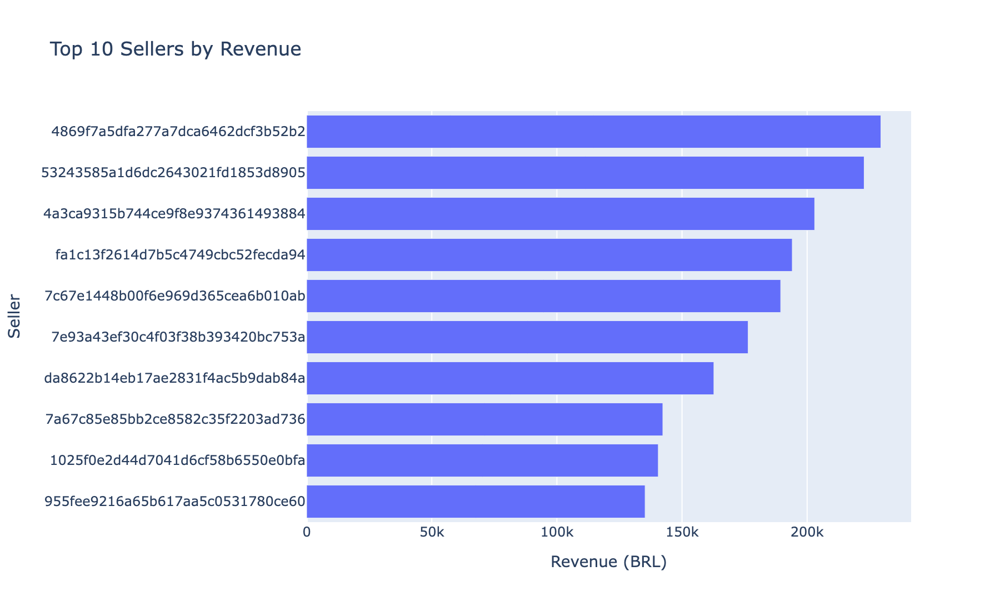

# Olist Brazilian E-Commerce Analysis

End-to-end analysis of ~99K orders from [Olist's Brazilian e-commerce dataset](https://www.kaggle.com/datasets/olistbr/brazilian-ecommerce): SQL exploration, pandas cleaning, an interactive dashboard, and a business memo.

**TL;DR:** late delivery is the strongest driver of poor reviews (4.21 avg score on-time vs 2.55 late), delays are heavily concentrated in northern Brazilian states, and cancellations cluster in a small set of underperforming sellers. Full writeup in [`memo.md`](memo.md).

## Structure

```
olist-project/
├── data/                              raw CSVs (gitignored — see data/README.md to fetch)
├── load_db.py                         loads CSVs into a local SQLite DB (olist.db)
├── week1_queries.sql                  10 SQL queries: joins, aggregations, window functions
├── week2_analysis.py                  pandas cleaning + delivery/review correlation analysis
├── week2_category_delivery_reviews.csv  output of week2_analysis.py
├── dashboard.py                       interactive Dash app (4 views, filterable)
├── screenshots/                       static exports of each dashboard view
└── memo.md                            1-page business memo: findings + recommendations
```

## Setup

```bash
pip install pandas dash plotly kaggle kaleido
```

See [`data/README.md`](data/README.md) for fetching the dataset and building the database.

## Running it

**SQL queries** (against the SQLite DB):
```bash
sqlite3 olist.db < week1_queries.sql
```

**Pandas analysis:**
```bash
python3 week2_analysis.py
```

**Dashboard:**
```bash
python3 dashboard.py
```
Then open http://127.0.0.1:8050

## Dashboard preview

| Sales Trend | Delivery by State |
|---|---|
|  |  |

| Satisfaction Drivers | Seller Leaderboard |
|---|---|
|  |  |

## Key findings

1. **Delivery timing beats category as a driver of review score.** Category-level correlation between on-time rate and review score is weak (0.22), but at the order level, on-time orders average 4.21/5 vs 2.55/5 for late ones.
2. **Delay is regional.** Northern states (RR, AP, AM) average 26-29 delivery days vs 8.8 in São Paulo.
3. **Cancellations concentrate in a handful of sellers**, not evenly across the platform.

Full context and recommendations: [`memo.md`](memo.md)
